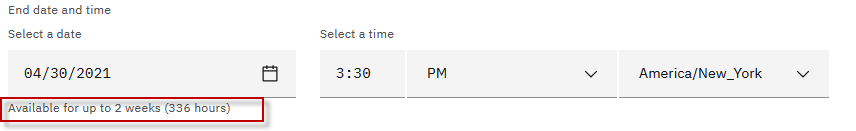

# Reserve a single environment for demos or self-enablement

Need support? Contact **Kevin Postreich**, **Yi Tang**

|         |           |  
| ------------- |:-------------|
|    | <strong>IMPORTANT:</strong>    A VMWare on IBM Cloud lab environment is provided for the labs/demos in this asset.   Environment reservations are immediate and can be reserved for up to two weeks in duration.   Use the instructions below to reserve your demo/lab environment. 

1.  Use the link below to access the **Liberty Workshop** environment reservations page.  

    <https://techzone.ibm.com/my/reservations/create/63877af037f8a600183c737b>

    a.  Use your **IBM ID** to login to the IBM Technology Zone

    b.  The **Create a reservation** page is displayed

     
	 
	  

2.  Select “**Reserve for Now**” Radio button, and then follow the
    on-screen dialog to reserve an environment in an IBM Cloud data center
    in the closest Geography (US-Central, EMEA, Asia Pacific)
    
    a.  The environment **name** should be pre-filled with “**Liberty Workshop environment - VMWare**”
    
    b.  **Purpose**: Select a `purpose` from the drop-down menu
	
	> **AVOID TROUBLE:** Selecting TEST only reserves an environment for **4 hours**. If you need the evironment for up to two weeks, select a purpose other than Test.
	
	 
    
    c.  **Customer name(s)**: If, in the "Purpose" field, you selected `demo`, `proof of technology` or `proof of concept`, then customer name(s) is a required field. Enter customer name(s).
	
	d.  **Description**: Enter a description. The field is required.
    
    e.  **End date and time**: Use the calendar widget and select the
        maximum date available (2 weeks from date of reservation)
		
    f.  **Select a time**: Select a time of day for reservation to
        expire
    
    g.  Select a **timezone** nearest to you

    

     

3.  Preferred Geography: Choose an IBM Cloud datacenter in the closest
    geography (US, EMEA, Asia Pacific)

    
	
	 

4.  One complete, click on the “**Submit**” Button

     

5.  The reservation takes a moment to be created. When it is created,
    click on the “**My reservations**”
     button to see the detail so of
    the environment reservation.

    **Note:** The details of your environment reservation are displayed.

6.  Then click the reservation page to access the reservation details.

    
	
	 

7.  On the reservation details page, you will find the **Published Service** that is used to access the lab environment. 

8.  Now open the specific lab guide you want to use, and follow the instructions for using the **Published Service** link to access the lab environment and how to login to the VM. 

     

### **The lab environment**

One Ubuntu Linux VM has been provided for this lab. The environment should start automatically and will take several minutes to be **ready**. 

The login credentials for the **workstation** VM is:

  - User ID: **ibmdemo**
 
  - Password: **passw0rd**

Now you are ready to use the specific lab guides to setup for demos or self-enablement. 

The labs are available from the **Navigation** pane on the left side of the page. 

### **How do I find my environment in IBM Technology Zone**

You may have reserved an environment for multiple days, up to two weeks. Let's say you shutdown your laptop for the day and need to access your environment at a later date, within the reservation period. 

This section describes how to find your environment reservations in the IBM Technology Zone. 

1. Go to the IBM technology Zone URL: https://techzone.ibm.com/
2. Login using your IBM ID, if requested. 
3. From the main menu in Tech Zone, navigate to **My Library > My Reservations**

    

     

4. Select the **Liberty Workshop environment - VMWare** reservation

    

