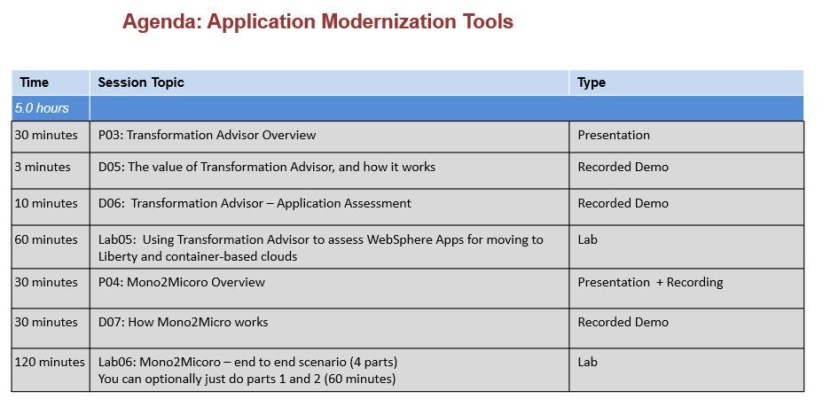

# Liberty Workshop 

## Workshop content duration

Approximately **5 hours** if using all of the Liberty content. 

Approximately **5 hours** if using all of the Transformation Advisor and Mono2Micro content. 

<h2>Workshop Introduction</h2>

This course introduces the attendees to Liberty, Mono2Micro, and Transformation Advisor.

The workshop can be used to support two distinct agendas, or you can mix and match, as all of the hands-on labs are supported on a single Lab environment. 

1. Liberty   (up to 5 hours)
2. Application Modernization Tools (up to 5 hours) 

Workshop Objectives:

  - Learn basic Liberty concepts, archive installation, and working with Liberty in various development environments and containers
  - Learn how to use Mono2Micro to create partitioned services from WebSphere monolith applications
  - Learn how to use Transformation Advisor to assess WebSphere Applications for moving to container-based clouds

At the end of this workshop, the attendee will learn how to install Liberty, understand Liberty concepts, use Liberty in common IDE’s, Dev Mode, in containers, and from the command line. 

Attendees get hands-on experience using Mono2Micro from end-to-end, including code generation and deployment of the new partitioned services in Liberty running in containers. 

Attendees also gain experience using Transformation Advisor during the Java application assessment phase of application modernization journey to Liberty and container-based clouds.

This course is geared toward developers and architects who are seeking to understand fundamentals of working with Liberty, Mono2Micro, and Transformation Advisor tools for modernizing traditional WebSphere applications.

This is a hands-on workshop that contains the following exercises:

  - Liberty archive installation and setup
  - Getting started with Liberty with Liberty Tools in Eclipse IDE, and command line
  - Using Liberty in Dev Mode via command line
  - Using Liberty Tools in VS Code IDE
  - Using Mono2Micro to create partition services from a WebSphere monolith application
  - Using Transformation Advisor to assess WebSphere applications and deployig to Liberty and containers

<h2 style="color:green">Reserve lab environments</h2>

Please follow the [reserve environment instructions](./environments-setup/index.md) to reserve a lab environment, or schedule a workshop. The lab environment is configured with the tools you need to be able to complete the labs.

**Note:** Workshop environments must be scheduled at least **3 Days** prior to the delivery day of the workshop.

<h2> Proposed Liberty Agenda </h2> 

  

<h2> Proposed Application Modernization Tools Agenda </h2> 

  

  
<h3> Agenda Deck </h3>
[Workshop Agenda deck](https://ibm.box.com/v/LibertyWorkshop-agenda)
   
<h3> Presentations </h3>

[Presentation material](https://ibm.box.com/v/LibertyWorkshop-presentations)

<h3> Recorded Presentations </h3>

[Recorded Presentations](https://ibm.box.com/v/LibertyWS-recordedPres)

<h3> Recorded Demonstrations </h3>

[Recorded Demonstrations](https://ibm.box.com/v/LibertyWS-recordDemos)
   

<h3> Hands-on Labs </h3>

[Hands-on Labs](./LibertyLabs.md)
   

